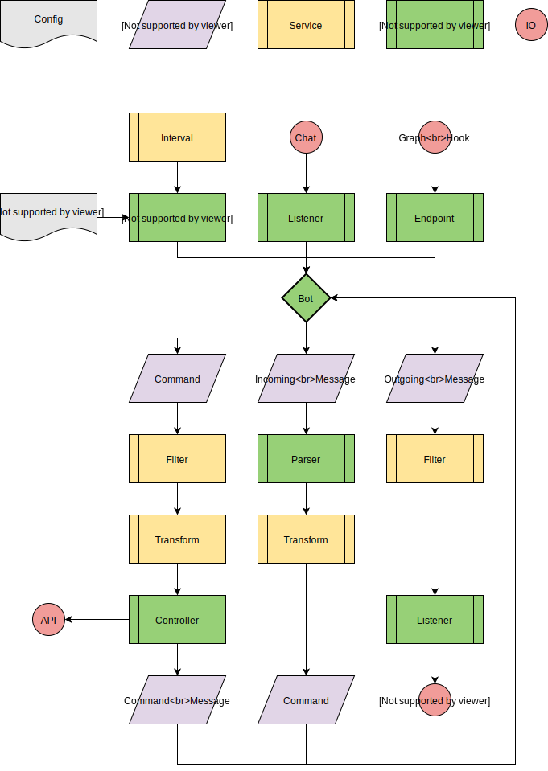

# Architecture

- [Architecture](#architecture)
  - [Incoming Messages](#incoming-messages)
    - [Completion](#completion)
  - [Executing Commands](#executing-commands)
  - [Outgoing Messages](#outgoing-messages)
  - [Cross-Platform Compatibility](#cross-platform-compatibility)
  - [Services](#services)
    - [Controller](#controller)
    - [Filter](#filter)
    - [Interval](#interval)
    - [Listener](#listener)
    - [Parser](#parser)
    - [Transform](#transform)

The bot uses a fairly traditional service-based structure, with an entry point loading the config.

The primary service and root of the config file is the `kind: bot`, which launches the other services and acts as the
central broker for events.

Events come in two types: commands and messages (incoming and outgoing). Commands are executed by a controller,
causing some side effects. Messages are sent and received by listeners, and turned into commands by a parser. At every
step, filters may drop events.

That flow is:

## Incoming Messages

Incoming messages show up within a listener, usually as events fired by some chat client or other library. The input
messages are normalized, users matched with their sessions, and MIME types attached as needed. These messages are sent
to the bot, to be parsed into commands.

Parsers range from simple ones like the `split-parser`, which splits on whitespace while respecting quotes and
parentheses, to more complex ones like the `lex-parser`, which uses Amazon Lex to interpret natural language. All
parsers are responsible for creating a command, with a noun and verb, and filling in the data (arguments) needed to
execute that command.

### Completion

When a message is parsed, while valid, it may turn out to be incomplete (missing some required data, needs confirmation,
etc.). Most parsers can prompt the user to complete the command, following Amazon Lex's model for completing slots.
Completion is a `fragment:create` command, executed by a completion controller (there may be many). The command
fragment will be stored in the database and given a completion ID, which may be used later to complete and execute the
original command.

## Executing Commands

Once a command has been parsed, it will be sent to the controllers. Each controller handles a set of nouns, but may use
labels or rules to filter their commands down further. The controller is responsible for deciding which verbs are
supported by those nouns and fetching parameters from the command, then runs some side effect. The most common side
effects are persisting an entity to the database or calling an outside API, such as Github, Gitlab, or kubernetes.

## Outgoing Messages

Most commands produce some result that needs to be sent back to the user, usually as a reply in the same channel as the
original message. The channel, thread, and user information is retained by the context attached to the messages and
command. Controllers create and send messages back to the bot, which routes them out through the correct listener.

## Cross-Platform Compatibility

A single bot may be connected to many different chat platforms and running an HTTP listener for incoming webhooks and
other messages. To keep controllers simple and messages consistent, the listener and parser are responsible for
normalizing incoming messages and extracting the noun, verb, and data. To support audio and images, messages are tagged
with a MIME type.

## Services

Services are created by the bot, based on the config, and their life cycle managed by the root (bot) service. To keep
reasonable encapsulation, services are formally managed by a service module, which later acts as a locator using the
service metadata.

### Controller

Controllers execute commands, cause side effects, and may reply with the results. Checking grants before running the
side effects and transforming the results into a suitable reply, or error message, are left to the controller.

### Filter

Filters examine passing commands and messages, using fixed-function or rule-based conditions to allow, drop, or ignore.

Every service may have filters, including filters, which should allow for limited logic.

### Interval

Intervals occasionally emit a command, event, or message. Some operate on regular intervals, cron or time expressions,
while others respond to external stimuli.

### Listener

Listeners connect to a chat service or some other API, then broker messages between it and the rest of the bot.
Depending on the source, listeners vary widely. Some connect to a socket, some need to poll an HTTP endpoint (which may
be triggered by an interval), and others may listen on a path within the HTTP listener.

### Parser

Parsers turn messages into commands, by parsing the body. Most parsers handle a single body type, although some do
support both text and audio. Incomplete commands are sent to a completion controller for persistence and later
execution, while completed commands are sent off to be executed.

### Transform

Transforms are used by controllers to modify their results and typically run after the side effect has happened or
failed. Common transforms are able to template and query (via jsonpath) the command and its results, and may (as with
all services) have filters to ignore some results.
