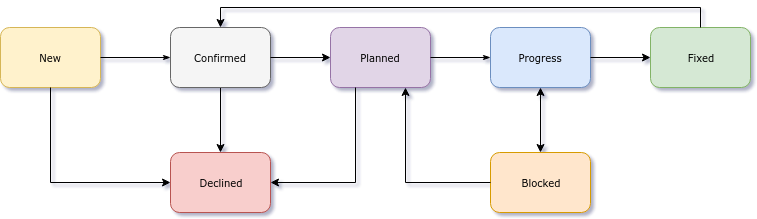

# Workflow

This document describes the issue and merge workflow for the isolex project.

- [Workflow](#workflow)
  - [Branches](#branches)
  - [Issues](#issues)
    - [Service](#service)
    - [Status](#status)
    - [Type](#type)
      - [Bug](#bug)
      - [Feature](#feature)
      - [Update](#update)
  - [Merges](#merges)
  - [Updates](#updates)

## Branches

Branch early, commit often.

Rebase on the target branch before creating a PR to ensure minimal differences.

## Issues

Issues are broken down by the `service` they impact (with `service/other` as a catch-all) and their current `status`.

- [Create a new bug](https://github.com/ssube/isolex/issues/new?template=type_bug.md).
- [Create a new feature](https://github.com/ssube/isolex/issues/new?template=type_feature.md).
- [Create a new update](https://github.com/ssube/isolex/issues/new?template=type_update.md).

### Service

### Status

New issues should be confirmed (to exist, get details, etc) before any planning happens. Issues with a feature branch
are in progress. Finally, issues should not be closed until the fix can be confirmed.

### Type

#### Bug

Bugs are problems with documented behavior, missing features that should exist, or anything else that seems out of
place.

[Create a new bug](https://github.com/ssube/isolex/issues/new?template=type_bug.md).

#### Feature

Features are new feature requests, new options, and other suggestions to add things.

[Create a new feature](https://github.com/ssube/isolex/issues/new?template=type_feature.md).

#### Update

Updates are routine updates of existing features and dependencies, with any associated work to update options or tests.

[Create a new update](https://github.com/ssube/isolex/issues/new?template=type_update.md).

## Merges

The `master` branch is the stable, usable branch and is automatically deployed.

Code should only be merged into master after:

- a pipeline has run and passed
- tests have been written and pass
- coverage has not decreased
- lint warnings have been resolved

Branches should be squashed before merging and the merge commit must follow
[conventional commit](https://www.conventionalcommits.org/en/v1.0.0-beta.2/) syntax. Valid prefixes are:

- `build`
- `deps` (type/update)
- `docs`
- `feat` (type/feature)
- `fix` (type/bug)
- `lint` (type/lint)
- `test`

## Updates

When updating dependencies, use the `~X.Y` (major-minor range) for anything with a `1.0` release and `^X.Y.Z` for
anything without.

Generally update dependencies one (or a related few) at a time and try not to update dev and prod dependencies at the
same time.